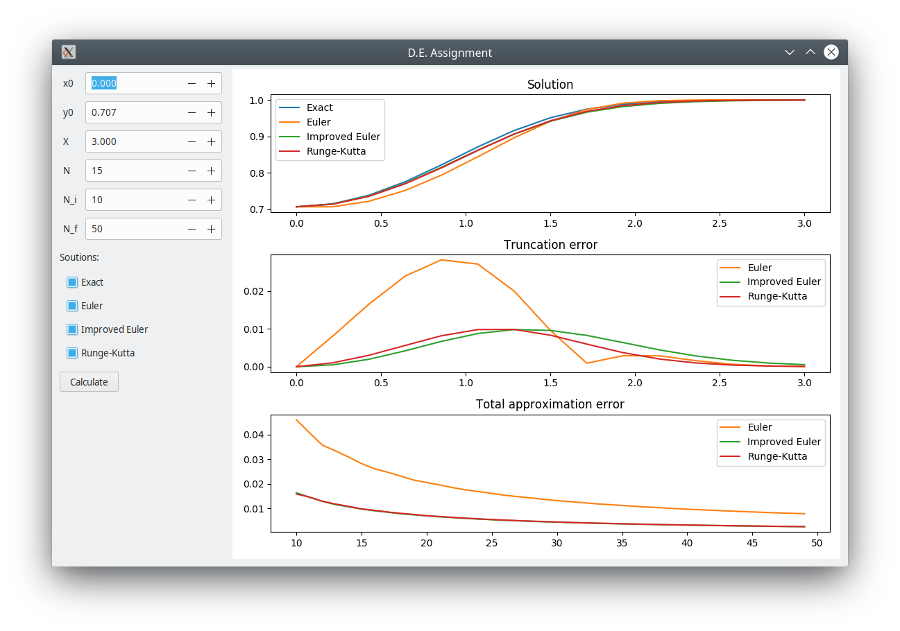
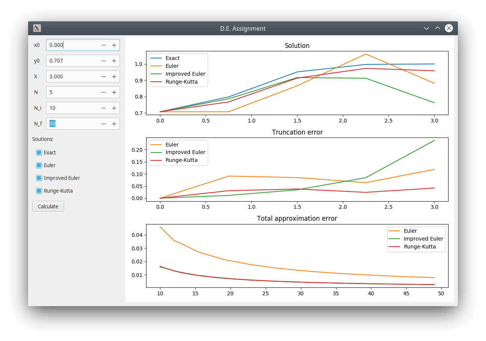
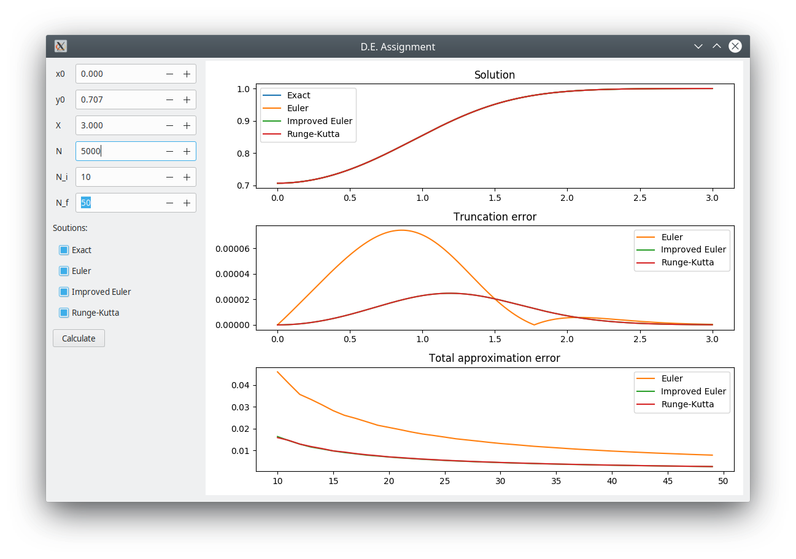
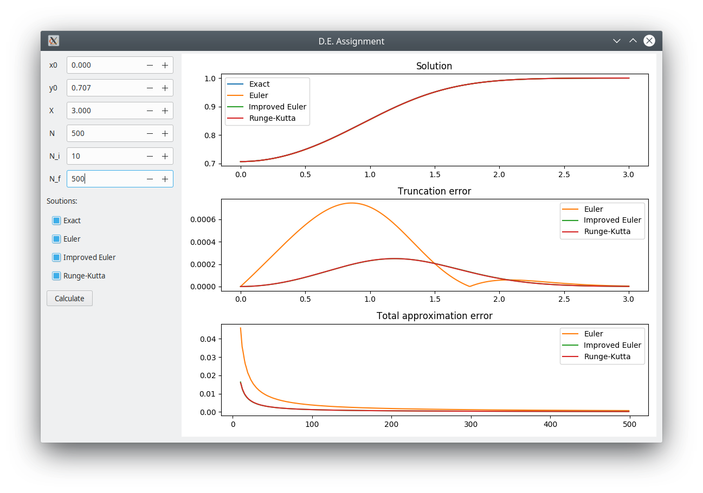
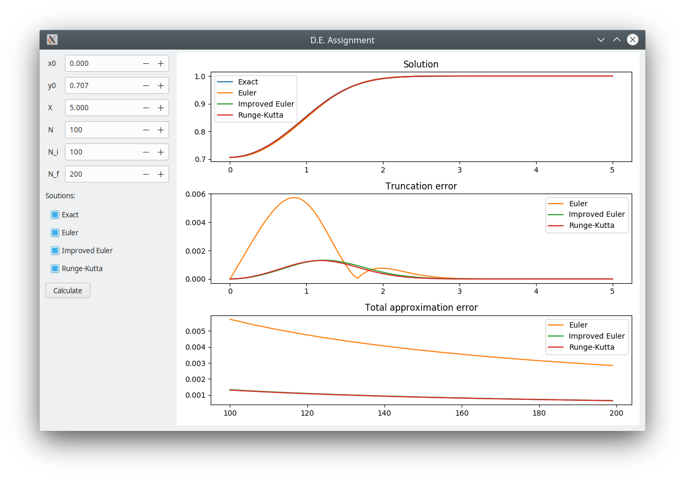
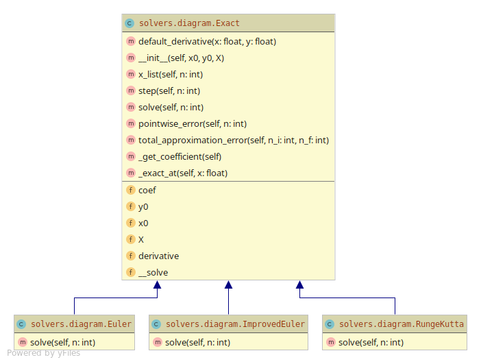

# Differential Equations numerical assignment
Made by: Mikhail Kuskov, B18-01

- [Differential Equations numerical assignment](#differential-equations-numerical-assignment)
  - [Analytical solution](#analytical-solution)
  - [Application](#application)
    - [Application GUI](#application-gui)
  - [Source Code](#source-code)
    - [Exact solution](#exact-solution)
    - [Euler method](#euler-method)
    - [Improved Euler method](#improved-euler-method)
    - [Runge-Kutta method](#runge-kutta-method)
  - [Numerical Investigation](#numerical-investigation)
  - [UML Class Diagram](#uml-class-diagram)

## Analytical solution

Given function
$$f(x,y)=y'=xy-xy^3$$
with IVP: $y(x_0)=y_0$

Solution:
1) Let's transform equation to the first order Bernoulli ODE:
   $y'-xy=-xy^3$ and we have $p(x)=-x$, $q(x)=-x$, $n=3$.
2) Let's substitute $v=y^{1-n}=y^{-2}$ and
   obtain $-\frac{v'}{2}-xv=-x$.
3) Solving complementary we obtain $v(x)=k*e^{-x^2}$ and
   by method of variation of parameter we get the final solution
   for $v(x)=c_1e^{-x^2}+1$
4) Than, substituting back $v=y^{-2}$ we get: 
   $y^{-2}=c_1 \cdot e^{-x^2}+1$,
   which is $y=\sqrt{ \frac{1}{c_1 \cdot e^{-x^2}+1} }$, 
   $y=-\sqrt{ \frac{1}{c_1 \cdot e^{-x^2}+1} }$
5) With given IVP: $y(0)=\sqrt{\frac{1}{2}}$, we can derive formula     for $c_1=\frac{(1-y_0^2)\cdot e^{x_0^2}}{y_0^2}$ and compute $c_1$
   for given particular case $c_1=1$

There is **no points of discontinuity** on the given interval
$x \in [0,3]$

## Application

Application interface seems to be intuitive.
User can change $x_0,y_0,X,N$ to play with parameters of
approximation and $N_i,N_f$ to see the dependency of methods'
accuracy on $N$. Changes are reactively propagate and user interface
updated accordingly to them

### Application GUI


## Source Code

### Exact solution
is computed with __exact_at_ function
```python
def _exact_at(self, x: float):
        return math.e ** (x ** 2 / 2) / \
               math.sqrt(self.coef + math.e ** (x ** 2))
```
which is applied to a vector of points with length $n$
over interval $(x_0, X)$
```python
def solve(self, n: int) -> np.array:
        # Apply vectorized '_exact_at' to each x point
        vfunc = np.vectorize(self._exact_at)
        return vfunc(self.x_list(n))
```

### Euler method
is computed like so
```python
def solve(self, n: int) -> np.array:
        t = self.x_list(n)
        y = np.full(n, self.y0)
        step = self.step(n)

        for i in range(1, n):
            y[i] = y[i - 1] + step * self.derivative(t[i - 1], y[i - 1])
        return y
```
### Improved Euler method
is computed like so
```python
def solve(self, n: int) -> np.array:
        t = self.x_list(n)
        y = np.full(n, self.y0)
        step = self.step(n)

        for i in range(1, n):
            y_ = y[i - 1] + step * self.derivative(t[i - 1], y[i - 1])
            y[i] = y[i - 1] + 0.5 * step * (self.derivative(t[i - 1], y[i - 1])
                                            + self.derivative(t[i], y_))
        return y
```
### Runge-Kutta method
is computed like so
```python
def solve(self, n: int) -> np.array:
        t = self.x_list(n)
        y = np.full(n, self.y0)
        step = self.step(n)

        for i in range(1, n):
            k1 = step * self.derivative(t[i - 1], y[i - 1])
            k2 = step * self.derivative(t[i - 1] + step / 2, y[i - 1] + k1 / 2)
            k3 = step * self.derivative(t[i - 1] + step / 2, y[i - 1] + k2 / 2)
            k4 = step * self.derivative(t[i - 1] + step, y[i - 1] + k3)

            y[i] = y[i - 1] + 1 / 6 * (k1 + 2 * k2 + 2 * k3 + k4)

        return y
```


## Numerical Investigation

We can see that with increasing $N$, the error of solutions is
decreasing proportionally

$x_0=0,y=\sqrt{\frac{1}{2}},X=3,N=5,N_i=10,N_f=50$


$x_0=0,y=\sqrt{\frac{1}{2}},X=3,N=5000,N_i=10,N_f=50$


$x_0=0,y=\sqrt{\frac{1}{2}},X=3,N=500,N_i=10,N_f=500$


$x_0=0,y=\sqrt{\frac{1}{2}},X=5,N=100,N_i=100,N_f=200$


As we see, with increasing $N$ the approximation of solution is
increasing appropriately

## UML Class Diagram


